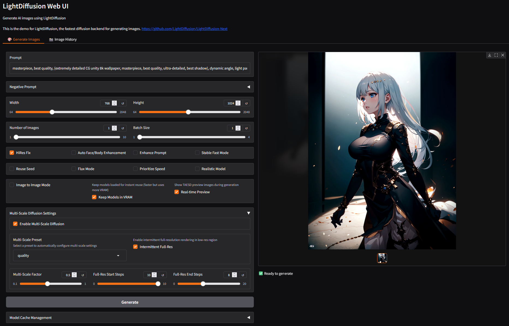

<div align="center">

# Say hi to LightDiffusion-Next 👋

[](https://huggingface.co/spaces/Aatricks/LightDiffusion-Next)&nbsp;

**LightDiffusion-Next**  is the fastest AI-powered image generation WebUI, combining speed, precision, and flexibility in one cohesive tool.
</br>
</br>
  <a href="https://github.com/LightDiffusion/LightDiffusion-Next">
    

  </a>
</br>
</div>

As a refactored and improved version of the original [LightDiffusion repository](https://github.com/Aatrick/LightDiffusion), this project enhances usability, maintainability, and functionality while introducing a host of new features to streamline your creative workflows.

## Motivation:

**LightDiffusion** was originally meant to be made in Rust, but due to the lack of support for the Rust language in the AI community, it was made in Python with the goal of being the simplest and fastest AI image generation tool.

That's when the first version of LightDiffusion was born which only counted [3000 lines of code](https://github.com/LightDiffusion/LightDiffusion-original), only using Pytorch. With time, the [project](https://github.com/Aatrick/LightDiffusion) grew and became more complex, and the need for a refactor was evident. This is where **LightDiffusion-Next** comes in, with a more modular and maintainable codebase, and a plethora of new features and optimizations.

📚 Learn more in the [official documentation](https://aatrick.github.io/LightDiffusion/).

---

## 🌟 Highlights


**LightDiffusion-Next** offers a powerful suite of tools to cater to creators at every level. At its core, it supports **Text-to-Image** (Txt2Img) and **Image-to-Image** (Img2Img) generation, offering a variety of upscale methods and samplers, to make it easier to create stunning images with minimal effort.

Advanced users can take advantage of features like **attention syntax**, **Hires-Fix** or **ADetailer**. These tools provide better quality and flexibility for generating complex and high-resolution outputs.

**LightDiffusion-Next** is fine-tuned for **performance**. Features such as **Xformers** acceleration, **BFloat16** precision support, **WaveSpeed** dynamic caching, **Multi-scale diffusion**, and **Stable-Fast** model compilation (which offers up to a 70% speed boost) ensure smooth and efficient operation, even on demanding workloads.

---

## ✨ Feature Showcase

Here’s what makes LightDiffusion-Next stand out:

- **Speed and Efficiency**:
  Enjoy industry-leading performance with built-in Xformers, Pytorch, Wavespeed and Stable-Fast optimizations, Multi-scale diffusion, achieving up to 30% faster speeds compared to the rest of the AI image generation backends in SD1.5 and up to 2x for Flux.

- **Automatic Detailing**:
  Effortlessly enhance faces and body details with AI-driven tools based on the [Impact Pack](https://github.com/ltdrdata/ComfyUI-Impact-Pack).

- **State Preservation**:
  Save and resume your progress with saved states, ensuring seamless transitions between sessions.

- **Integration-Ready**:
  Collaborate and create directly in Discord with [Boubou](https://github.com/Aatrick/Boubou), or preview images dynamically with the optional **TAESD preview mode**.

- **Image Previewing**:
  Get a real-time preview of your generated images with TAESD, allowing for user-friendly and interactive workflows.

- **Image Upscaling**:
  Enhance your images with advanced upscaling options like UltimateSDUpscaling, ensuring high-quality results every time.

- **Prompt Refinement**:
    Use the Ollama-powered automatic prompt enhancer to refine your prompts and generate more accurate and detailed outputs.

- **LoRa and Textual Inversion Embeddings**:
    Leverage LoRa and textual inversion embeddings for highly customized and nuanced results, adding a new dimension to your creative process.

- **Low-End Device Support**:
    Run LightDiffusion-Next on low-end devices with as little as 2GB of VRAM or even no GPU, ensuring accessibility for all users.

- **CFG++**:
    Uses samplers modified to use CFG++ for better quality results compared to traditional methods.

---

## ⚡ Performance Benchmarks

**LightDiffusion-Next** dominates in performance:

| **Tool**                           | **Speed (it/s)** |
|------------------------------------|------------------|
| **LightDiffusion with Stable-Fast** | 2.8              |
| **LightDiffusion**                 | 1.9              |
| **ComfyUI**                        | 1.4              |
| **SDForge**                        | 1.3              |
| **SDWebUI**                        | 0.9              |

(All benchmarks are based on a 1024x1024 resolution with a batch size of 1 using BFloat16 precision without tweaking installations. Made with a 3060 mobile GPU using SD1.5.)

With its unmatched speed and efficiency, LightDiffusion-Next sets the benchmark for AI image generation tools.

---

## 🛠 Installation

### Quick Start

1. Download a release or clone this repository.
2. Run `run.bat` in a terminal.
3. Start creating!

### 🐳 Docker Setup

Run LightDiffusion-Next in a containerized environment with GPU acceleration:

**Prerequisites:**
- Docker with NVIDIA Container Toolkit installed
- NVIDIA GPU with CUDA support

**Quick Start with Docker:**
```bash
# Build and run with docker-compose (recommended)
docker-compose up --build

# Or build and run manually
docker build -t lightdiffusion-next .
docker run --gpus all -p 7860:7860 -v ./output:/app/output lightdiffusion-next
```

**Access the Gradio Web Interface:**
Open your browser and navigate to `http://localhost:7860`

**Volume Mounts:**
- `./output:/app/output` - Persist generated images
- `./checkpoints:/app/include/checkpoints` - Store model files
- `./loras:/app/include/loras` - Store LoRA files
- `./embeddings:/app/include/embeddings` - Store embeddings


### Advanced Setup

- **Install from Source**:
  Install dependencies via:
  ```bash
  pip install -r requirements.txt
  ```
  Add your SD1/1.5 safetensors model to the `checkpoints` directory, then launch the application.

- **⚡Stable-Fast Optimization**:
  Follow [this guide](https://github.com/chengzeyi/stable-fast?tab=readme-ov-file#installation) to enable Stable-Fast mode for optimal performance.

- **🦙 Prompt Enhancer**:
  Refine your prompts with Ollama:
  ```bash
  pip install ollama
  ollama run deepseek-r1
  ```
  See the [Ollama guide](https://github.com/ollama/ollama?tab=readme-ov-file) for details.

- **🤖 Discord Integration**:
  Set up the Discord bot by following the [Boubou installation guide](https://github.com/Aatrick/Boubou).

---

🎨 Enjoy exploring the powerful features of LightDiffusion-Next!
