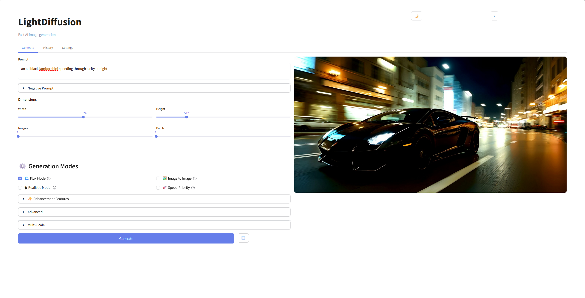

<div align="center">

# Say hi to LightDiffusion-Next 👋

[](https://huggingface.co/spaces/Aatricks/LightDiffusion-Next)&nbsp;

**LightDiffusion-Next**  is the fastest AI-powered image generation WebUI, combining speed, precision, and flexibility in one cohesive tool.
</br>
</br>
  <a href="https://github.com/LightDiffusion/LightDiffusion-Next">
    

  </a>
</br>
</div>

---

As a refactored and improved version of the original [LightDiffusion repository](https://github.com/Aatrick/LightDiffusion), this project enhances usability, maintainability, and functionality while introducing a host of new features to streamline your creative workflows.


## Motivation:

**LightDiffusion** was originally meant to be made in Rust, but due to the lack of support for the Rust language in the AI community, it was made in Python with the goal of being the simplest and fastest AI image generation tool.

That's when the first version of LightDiffusion was born which only counted [3000 lines of code](https://github.com/LightDiffusion/LightDiffusion-original), only using Pytorch. With time, the [project](https://github.com/Aatrick/LightDiffusion) grew and became more complex, and the need for a refactor was evident. This is where **LightDiffusion-Next** comes in, with a more modular and maintainable codebase, and a plethora of new features and optimizations.

📚 Learn more in the [official documentation](https://aatrick.github.io/LightDiffusion/).

---

## 🌟 Highlights


**LightDiffusion-Next** offers a powerful suite of tools to cater to creators at every level. At its core, it supports **Text-to-Image** (Txt2Img) and **Image-to-Image** (Img2Img) generation, offering a variety of upscale methods and samplers, to make it easier to create stunning images with minimal effort.

Advanced users can take advantage of features like **attention syntax**, **Hires-Fix** or **ADetailer**. These tools provide better quality and flexibility for generating complex and high-resolution outputs.

**LightDiffusion-Next** is fine-tuned for **performance**. Features such as **Xformers** acceleration, **BFloat16** precision support, **WaveSpeed** dynamic caching, **Multi-scale diffusion**, and **Stable-Fast** model compilation (which offers up to a 70% speed boost) ensure smooth and efficient operation, even on demanding workloads.

---

## ✨ Feature Showcase

Here’s what makes LightDiffusion-Next stand out:

- **Speed and Efficiency**:
  Enjoy industry-leading performance with built-in Xformers, Pytorch, Wavespeed and Stable-Fast optimizations, Multi-scale diffusion, achieving up to 30% faster speeds compared to the rest of the AI image generation backends in SD1.5 and up to 2x for Flux.

- **Automatic Detailing**:
  Effortlessly enhance faces and body details with AI-driven tools based on the [Impact Pack](https://github.com/ltdrdata/ComfyUI-Impact-Pack).

- **State Preservation**:
  Save and resume your progress with saved states, ensuring seamless transitions between sessions.

- **Integration-Ready**:
  Collaborate and create directly in Discord with [Boubou](https://github.com/Aatrick/Boubou), or preview images dynamically with the optional **TAESD preview mode**.

- **Image Previewing**:
  Get a real-time preview of your generated images with TAESD, allowing for user-friendly and interactive workflows.

- **Image Upscaling**:
  Enhance your images with advanced upscaling options like UltimateSDUpscaling, ensuring high-quality results every time.

- **Prompt Refinement**:
  Use the optional Ollama-powered prompt enhancer (defaults to `qwen3:0.6b`) to refine your prompts and generate more accurate and detailed outputs.

- **LoRa and Textual Inversion Embeddings**:
    Leverage LoRa and textual inversion embeddings for highly customized and nuanced results, adding a new dimension to your creative process.

- **Low-End Device Support**:
    Run LightDiffusion-Next on low-end devices with as little as 2GB of VRAM or even no GPU, ensuring accessibility for all users.

- **CFG++**:
    Uses samplers modified to use CFG++ for better quality results compared to traditional methods.

- **Newelle Extension**:
    LightDiffusion-Next is also available as a backend to the [Newelle LightDiffusion extension](https://github.com/Aatricks/Newelle-Light-Diffusion) permitting to generate images inline during conversations with llms.

---

## ⚡ Performance Benchmarks

**LightDiffusion-Next** dominates in performance:

| **Tool**                           | **Speed (it/s)** |
|------------------------------------|------------------|
| **LightDiffusion with Stable-Fast** | 2.8              |
| **LightDiffusion**                 | 1.9              |
| **ComfyUI**                        | 1.4              |
| **SDForge**                        | 1.3              |
| **SDWebUI**                        | 0.9              |

(All benchmarks are based on a 1024x1024 resolution with a batch size of 1 using BFloat16 precision without tweaking installations. Made with a 3060 mobile GPU using SD1.5.)

With its unmatched speed and efficiency, LightDiffusion-Next sets the benchmark for AI image generation tools.

---

## 🛠 Installation
> [!WARNING]
> **Disclaimer:** On Linux, the fastest way to get started is with the Docker setup below. Windows users often encounter an `EOF` build error when using Docker; if that happens, set up a local virtual environment instead and install SageAttention inside it.

### Quick Start

1. Download a release or clone this repository.
2. Run `run.bat` in a terminal.
3. The Streamlit UI will launch automatically at `http://localhost:8501`

**Alternative UIs:**
- **Streamlit UI** (default): Modern, clean interface with better organization
- **Gradio UI**: Run `python app.py` to use the original Gradio interface, mainly for huggingface spaces GPU compatibility.

### 🐳 Docker Setup

Run LightDiffusion-Next in a containerized environment with GPU acceleration:

> [!IMPORTANT]
> Confirm you have Docker Desktop configured with the NVIDIA Container Toolkit and at least 12-16GB of memory. Builds expect an NVIDIA GPU with compute capability 8.0 or higher and CUDA 12.0+ support for SageAttention/SpargeAttn.

**Quick Start with Docker:**
```bash
# Build and run with docker-compose (recommended - uses Streamlit by default)
docker-compose up --build

# Or build and run manually with Streamlit
docker build -t lightdiffusion-next .
docker run --gpus all -p 8501:8501 -e UI_FRAMEWORK=streamlit -v ./output:/app/output lightdiffusion-next

# To use Gradio instead:
docker run --gpus all -p 7860:7860 -e UI_FRAMEWORK=gradio -v ./output:/app/output lightdiffusion-next
```

**Custom GPU Architecture (Optional):**
```bash
# For faster builds, specify your GPU architecture (e.g., RTX 5060 = 12.0)
docker-compose build --build-arg TORCH_CUDA_ARCH_LIST="12.0"

# Default builds for: 8.0 (A100), 8.6 (RTX 30xx), 8.9 (RTX 40xx), 9.0 (H100), 12.0 (RTX 50xx)
```

**Built-in Optimizations:**
The Docker image can build the following acceleration paths:
- ✨ **SageAttention** - 15% speedup with INT8 quantization (all supported GPUs)
- 🚀 **SpargeAttn** - 40-60% speedup with sparse attention (compute 8.0-9.0 only)
- ⚡ **Stable-Fast** - Optional UNet compilation for up to 70% faster SD1.5 inference

Control them through build arguments (defaults shown below):

```bash
docker-compose build \
  --build-arg TORCH_CUDA_ARCH_LIST="8.0;8.6;8.9;9.0;12.0" \
  --build-arg INSTALL_STABLE_FAST=1 \
  --build-arg INSTALL_OLLAMA=0
```

Set `INSTALL_STABLE_FAST=1` to enable the compilation step for stable-fast, or `INSTALL_OLLAMA=1` to bake in the prompt enhancer runtime.

> [!NOTE]
> RTX 50 series (compute 12.0) GPUs currently only support SageAttention.

**Access the Web Interface:**
- **Streamlit UI** (default): `http://localhost:8501`
- **Gradio UI**: `http://localhost:7860` (set `UI_FRAMEWORK=gradio` in docker-compose.yml)

**Volume Mounts:**
- `./output:/app/output` - Persist generated images
- `./checkpoints:/app/include/checkpoints` - Store model files
- `./loras:/app/include/loras` - Store LoRA files
- `./embeddings:/app/include/embeddings` - Store embeddings


### Advanced Setup

- **Install from Source**:
  Install dependencies via:
  ```bash
  pip install -r requirements.txt
  ```
  Add your SD1/1.5 safetensors model to the `checkpoints` directory, then launch the application.

- **⚡Stable-Fast Optimization**:
  Follow [this guide](https://github.com/chengzeyi/stable-fast?tab=readme-ov-file#installation) to enable Stable-Fast mode for optimal performance.
  In Docker environments, set `INSTALL_STABLE_FAST=1` to compile it during the image build or `INSTALL_STABLE_FAST=0` (default) to skip.

- **🚀 SageAttention & SpargeAttn Acceleration**:
  Boost inference speed by up to 60% with advanced attention backends:

  **Prerequisites:**
  - [CUDA toolkit](https://developer.nvidia.com/cuda-toolkit-archive) installed with version compatible with your PyTorch installation
  
  **SageAttention (15% speedup, Windows compatible):**
  ```bash
  cd SageAttention
  pip install -e . --no-build-isolation
  ```
  
  **SpargeAttn (40-60% total speedup, requires WSL2/Linux):**
> [!CAUTION]
> SpargeAttn cannot be built with the default Windows linker. Use WSL2 or a native Linux environment and set the correct `TORCH_CUDA_ARCH_LIST` before installation.
  ```bash
  # On WSL2 or Linux only (Windows linker has path length limitations)
  cd SpargeAttn
  export TORCH_CUDA_ARCH_LIST="9.0"  # Or your GPU architecture (8.0, 8.6, 8.9, 9.0)
  pip install -e . --no-build-isolation
  ```
  
  **Priority System:** SpargeAttn > SageAttention > PyTorch SDPA
  - Both are automatically detected and used when available
  - Graceful fallback for unsupported head dimensions

- **🦙 Prompt Enhancer**:
  Turn on the Ollama-backed enhancer to automatically restructure prompts. By default the app targets `qwen3:0.6b`:
  ```bash
  # Local install
  pip install ollama
  curl -fsSL https://ollama.com/install.sh | sh

  # Start the Ollama daemon (keep this terminal open)
  ollama serve

  # New terminal: pull the default prompt enhancer model
  ollama pull qwen3:0.6b
  export PROMPT_ENHANCER_MODEL=qwen3:0.6b
  ```
  In Docker builds, set `--build-arg INSTALL_OLLAMA=1` (or update `docker-compose.yml`) to install Ollama and pre-pull the model automatically. You can override the runtime model/prefix with the `PROMPT_ENHANCER_MODEL` and `PROMPT_ENHANCER_PREFIX` environment variables. See the [Ollama guide](https://github.com/ollama/ollama?tab=readme-ov-file) for details.

- **🤖 Discord Integration**:
  Set up the Discord bot by following the [Boubou installation guide](https://github.com/Aatrick/Boubou).

### Third-Party Licenses
- This project distributes builds that depend on third-party open source components. For attribution details and the full license text, refer to `THIRD_PARTY_LICENSES.md`.

---

🎨 Enjoy exploring the powerful features of LightDiffusion-Next!

> [!TIP]
> ⭐ If this project helps you, please give it a star! It helps others discover it too.
